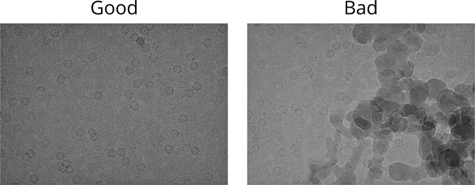
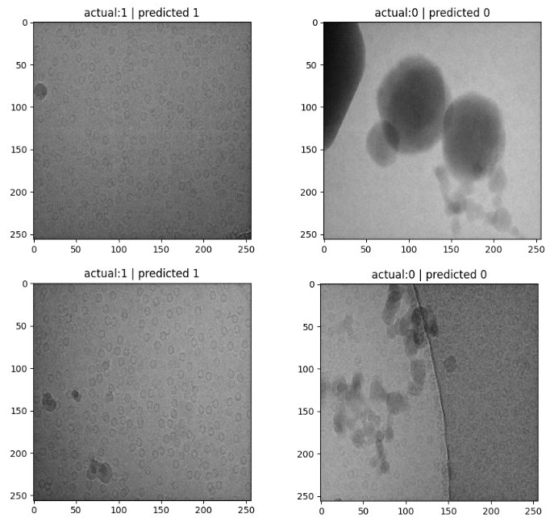

# image_classifier_cryo_EM_contamination

In this notebook we are initialising and training an image classifer using keras and tensorflow to classify cryo-EM images based on whether they are useful for processesing or if they are contaminated with crystalline ice and need to be removed from the dataset (see images below).

The two classes we are using are "good" (coded as 1) images for use in further processing and "bad" (coded as 0) images that have ice contamination. I intialised a ResNet-50 model and trained it on approximately 1000 images for 40 epochs until the loss and accuracy values plateau (see below).

The model was then tested on 86 labelled images and identified every image correctly. This is a highly effective image classifier for removing contaminated images from cryo-EM datasets (see below)

